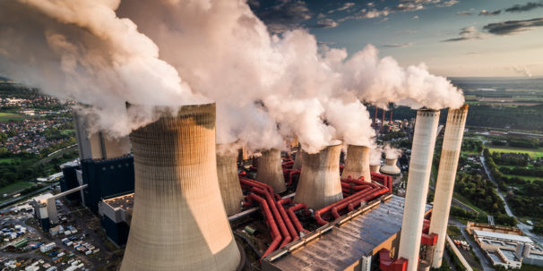
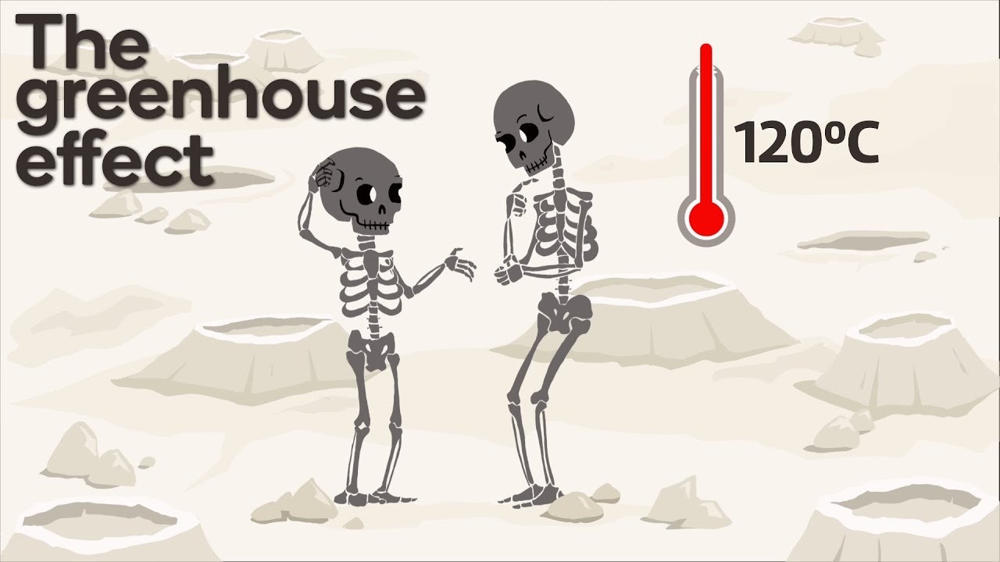

# Project 1: Global Warming – UK Greenhouse Gas Emissions
DAV Module 7 & 8 - Project 1 Group Challenge

## Background 

Global warming is unfortunately becoming more evident in recent years and is having a devastating impact on populations globally. We wanted to find out how much greenhouse gas emissions has been contributing to global warming in the UK. 

In order to analyze this, we looked specifically at the dataset for UK from 'https://climate-change.data.gov.uk/' data repository for the period of 1990-2020. 

First and formost, two datasets were obtained from the database, one archived on the basis of source of the greenhouse gas emmision and the other archived on the basis of End-users responsible for emission.

## Plan
## Who, what, where, when?

## 1. Which sector(s) are responsible for most of our emissions in the UK? 
### Sector v Sector
- a. Need to find the total emissions per Sector
- b. We need to compare Sector vs Sector emissions to compare and contrast
- c. We need to display the information in a visualisation, a pie chart would lend itself well to this data. 

## 2. Which end user is responsible for most of our emissions in the UK?
Compare user vs user 
### User v User
 - a. We need to find the total emissions per User
 - b. We need to compare User vs User emissions to compare and contrast
 - c. We need to display the information in a visualisation, a pie chart would lend itself well to this data. 
 
## 3. What is responsible for most of our emissions in the UK?
Compare the sources of emissions (i.e. fuel type)

### Emissions
- a. We need to find the categories of fuel 
- b. We need to find the total amount of emissions attributable to each fuel source
- c. We need to display the total emissions per source in a visualisation, a bar chart would work well. 
- d. We can analyse the data over time to see the growth of one fuel type vs the decline in another. 

## 4. When have emissions been highest in the UK?
Compare the recorded year statistics

### Total Emissions
- a. We need to calculate the total emissions emitted per year
- b. We need to compare and contrast total emissions for the period 
- c. We can display the data in a bar chart and a line graph to show growth and particular years of interest

## Conclude the trends of overall of emissions in the UK
Observations and insights

[Project 1 Rubric](https://docs.google.com/document/d/1fPa8EXPb5caZyzG2EdhzyWyhta9jC62siFMctNCvKog/edit)

## Observations and insights

The two datasets were obtained from 'https://climate-change.data.gov.uk/' cleaned and unnessary columns were taken out before commmencing the analysis.

## Major Sectors
First and formost we determined the major sectors that contributed towards the green gas emission for the UK (from 1990-2020). We compared the analysis between sources and end-users dataset. 

Unlike the popuplar opinion that transport is a major player, this analysis proved that this sector consitutes only 10% of the total while
87% of the emission is contributed by the top 4 sectors which includes Agriculture, Business, Transport, Energy and Land related activities.

In order to dive deeper into the four major sectors that are responsible for the 87% of the emission, we grouped together the dataset based on the Agriculture, Business, Transport, Energy & Land related activities and looked at the activities that were performed within these sectors.

# 1st Contributor
## Top 10 Agriculture activities that contributed to greenhouse gase emission.
### By Source

### By End-users

# 2nd Contributor
## Top 10 Business activities that contributed to greenhouse gase emission.
### By Source

### By End-users

# 3rd Contributor
## Top 10 Transport sector activities that contributed to greenhouse gase emission.
### By Source

### By End-users

# 4th Contributor
## Top 10 Energy sector activities that contributed to greenhouse gase emission (by source).

## Top 10 Land related activities that contributed to greenhouse gase emission (by end-users.

---------

## References
* https://climate-change.data.gov.uk/ 
* 2019 UK greenhouse gas emissions: final figures – dataset of emissions by source
https://beta.gss-data.org.uk/cube/explore?uri=http%3A%2F%2Fgss-data.org.uk%2Fdata%2Fgss_data%2Fclimate-change%2Fbeis-2019-uk-greenhouse-gas-emissions-final-figures-dataset-of-emissions-by-source-catalog-entry
* 2019 UK greenhouse gas emissions: final figures – dataset of emissions by end user
https://beta.gss-data.org.uk/cube/explore?uri=http%3A%2F%2Fgss-data.org.uk%2Fdata%2Fgss_data%2Fclimate-change%2Fbeis-2019-uk-greenhouse-gas-emissions-final-figures-dataset-of-emissions-by-end-user-catalog-entry 
* Image source: Future Learn
https://www.futurelearn.com/info/blog/greenhouse-gases-emissions-environment

- - -

Team - Group 4 (4)
* Grace Cheuk (gw-sc)
* Farjana Rowther (fbrowther)
* Navindeep Bains (navinbains)
* Salma Abdirahman (Salma-abdirahman)
